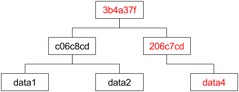

theme: Poster, 7

# [fit] Building Go
# [fit] With Bazel
### Paul Bellamy
#### @pyrhho

^ Around 6 months ago, building minimal docker images for go binaries

^ Multiple steps
Makefile hacks touch `.uptodate`
tarring the docker images
Why is this so hard?
Some co-workers suggested a load of stuff, led me eventually to bazel

---

# What is Bazel

^ From Google's internal build system
Very much still a work-in-progress.
Moving very quickly.

^ Packed roadmap
Stable 1.0 aimed for June next year (2018)

---

# Core Concepts

---

# 2 Languages

---

# BUILD 

^ Declarative language, more general and customizable than make
Shared with other build systems like buck and pants

```
genrule(
  name = "hello",
  outs = ["hello_world.txt"],
  cmd = "echo Hello World > $@",
)
```

^ genrule is the most basic, the equivalent of a make rule

^ BUILD files should be close to the source files
You end up with lots of them
In each directory
Can also be called "BUILD.bazel" to avoid conflicts

^ Somewhat opposite to go tools where everything is implicit. In bazel
everything is very explicit, but can be auto-generated.
gazelle for automated creation of them

^ Unlike make targets are not filenames

---

# Skylark

^ For extensions
even core languages are written in it
Similar to python
Define the impl of your rule, and it's attributes

```
def _impl(ctx):
  # You may use print for debugging.
  print("Rule name = %s, package = %s" % (ctx.label.name, ctx.label.package))

  # This prints the labels of the deps attribute.
  print("There are %d deps" % len(ctx.attr.deps))
  for i in ctx.attr.deps:
    print("- %s" % i.label)
    # A label can represent any number of files (possibly 0).
    print("  files = %s" % [f.path for f in i.files])

printer = rule(
    implementation=_impl,
    attrs={
      # Do not declare "name": It is added automatically.
      "number": attr.int(default = 1),
      "deps": attr.label_list(allow_files=True),
    })
```

---

# Repeatability
# Vendoring

^ Compare with `go build`

^ Vendors the entire build tool system, as much as possible
Go compiler gets vendored in, so you build with a specific go version
all the time.

^ A natural fit for go, plays well with godep, and not too bad with
gvt

^ Stops accidental vendor leaking

---

# Incremental

^ Basic merkle tree intro here

---


^ Tree of hashes
Leaf nodes with actual data,
then each node above that is a hash of the nodes below

---



^ If we change one of the leaf nodes, the hashes above it change, but
unchanged nodes don't.
Lends itself really well to structural sharing.
We can re-use old unchanged nodes.
This is why the BUILD files are close to the source files.

---

# Shared Caching

^ Because the incremental builds are so re-usable, we can share them
between developers.

^ As your team grows your average build times should shrink

^ Can set up a shared cache with nginx. very early stage

---

# Remote Workers

^ Coming from C, with long build-times outsourcing the work makes lots of sense

^ Server/client architecture, so first run is a bit slower, but
following builds are crazy fast

^ Even locally. First time launches a server. Unfortunately it is
java so it takes a while, but then after that, runs are fast.

^ No remote-version of this yet, but apis were just standardized.

---

# Sharding Tests

^ Have to declare your tests, but you get parallelization
^ Only run tests on changed files
^ Incremental testing

```
go_test(
    name = "mytest",
    srcs = ["file_test.go"],
    library = ":go_default_library"
)
```

---

# Polyglot

^ Makes it easy to integrate with many languages.
For projects with several languages involved.
Which is most, these days.

^ Focus is on C and Java, for now, but the language rules are plugins,
so they're very extensible.

---

# Alternatives

^ Buck, Pants, Etc, share BUILD language

^ Buck is facebook.
Pants is open-source collaborative

^ If you just want minimal docker builds use multi-stage docker builds now.

---

# Let's Build A Startup

^ Crowd-funding gag

^ Demo LaserSteak.com
Then go through code

---

# Workspaces

^ General setup

^ Similar to your git root

---

# rules_docker

^ Bazel has it's own docker container builder
Deterministic, so you just add files
github.com/bazelbuild/rules_docker
No docker required.
Can push/pull/build

^ Here I've based on alpine, don't have to

---

# rules_go

^ Transition to rules_go by talking about skylark and extensions.

^ Can be painful around protobufs

^ Still early
No support for:
- cross compilation
- C/C++ interoperation except cgo (swig etc.)
- coverage
- test sharding

^ Who wants to build a startup?

---

# Gazelle

^ Plays really nicely with godep or gvt

```
$ gazelle \
  -go_prefix github.com/paulbellamy/example \
  -external vendored
```

or, add 

```
gazelle(
  name = "gazelle",
  external = "vendored",
)

# then

$ bazel run //:gazelle
```

^ By default it assumes you've added each go dependency in your
WORKSPACE file, then bazel becomes your dependency manager. But
vendoring with gvt (or godep) works better for me, and keeps go tool
compatibility.

^ Link to: https://github.com/bazelbuild/rules_go/blob/master/Vendoring.md

---

# Webpack

^ A few early packages, but genrule is still your best bet for now

^ In general, this is a bit of a hack. genrules are discouraged in
favour of skylark extensions

^ Can be helpful to run your genrules in a docker container
periodically to check you haven't leaked any locally installed stuff.

---

# Target Syntax

@workspace//foo/bar:wiz

foo/...

:*

---

# Repeatable Builds

^ How to do these with `go build`
Big thing is vendoring
Versioning go toolchain

^ If you're really paranoid or hashing the binary:
Not writing timestamps into the binary
Not using any sort of randomness in the build
If you really want a timestamp use git commit

---

# Is It Worth It?

^ For very large projects
For polyglot projects (for example, protobufs, webpack, or yarn).
Building docker images

^ convention over configuration is very go
bazel is the opposite

^ In general, give it a couple months. Still developing very rapidly.

---

# Thanks

- Big thanks to: @tom_wilkie

---

# [fit] http://garlic.build

^ A thing I've started doing a bit of work on
Remote build-server for bazel
There are remote caches (you can configure nginx), but not open-source build-box yet.

^ If you're interested, please get in touch via that site

---

# More Reading

^ Questions? Lunch?

- Building Software at Google Scale
  https://www.youtube.com/watch?v=2qv3fcXW1mg
- Watch and rebuild (or run tests)
  https://github.com/bazelbuild/bazel-watcher
- Dave Cheney - Reproducible Builds
  http://go-talks.appspot.com/github.com/davecheney/presentations/reproducible-builds.slide#1

---


